# 🏗️ CampusHub - System Architecture Documentation

<div align="center">


[](https://microservices.io/)
[](https://martinfowler.com/articles/201701-event-driven.html)
[](https://12factor.net/)

[🏗️ System Overview](#️-system-overview) | [🔄 Data Flow](#-data-flow) | [📊 Service Architecture](#-service-architecture)

</div>

## 📋 Table of Contents

- [🎯 Architecture Overview](#-architecture-overview)
- [🏗️ System Design](#️-system-design)
- [📦 Service Architecture](#-service-architecture)
- [🔄 Data Flow](#-data-flow)
- [🗄️ Database Architecture](#️-database-architecture)
- [🌐 API Architecture](#-api-architecture)
- [🔐 Security Architecture](#-security-architecture)
- [📡 Communication Patterns](#-communication-patterns)
- [⚡ Performance Architecture](#-performance-architecture)
- [🚀 Deployment Architecture](#-deployment-architecture)
- [📊 Monitoring & Observability](#-monitoring--observability)
- [🔄 Scalability Strategy](#-scalability-strategy)
- [💡 Design Decisions](#-design-decisions)

## 🎯 Architecture Overview

CampusHub follows a **modern microservices architecture** with event-driven communication, implementing industry best practices for scalability, maintainability, and security.

### 🌟 Architectural Principles

- **🔄 Microservices Pattern**: Independent, loosely coupled services
- **📡 Event-Driven Architecture**: Asynchronous communication for better performance
- **🛡️ Security by Design**: Multi-layer security implementation
- **🚀 Cloud-Native**: Container-ready with 12-factor app principles
- **📊 Data-Driven**: Analytics and insights at the core
- **⚡ Performance First**: Optimized for high throughput and low latency

### 🎭 Key Architectural Characteristics

| Characteristic | Implementation | Benefit |
|----------------|----------------|---------|
| **Scalability** | Horizontal scaling with load balancers | Handle 10x user growth |
| **Reliability** | Circuit breakers and health checks | 99.9% uptime |
| **Security** | JWT, OAuth2, RBAC | Enterprise-grade security |
| **Performance** | Redis caching, database optimization | Sub-200ms response times |
| **Maintainability** | Clean architecture, SOLID principles | 50% faster development |
| **Observability** | Structured logging, metrics, tracing | Real-time insights |

## 🏗️ System Design

### 🌐 High-Level Architecture
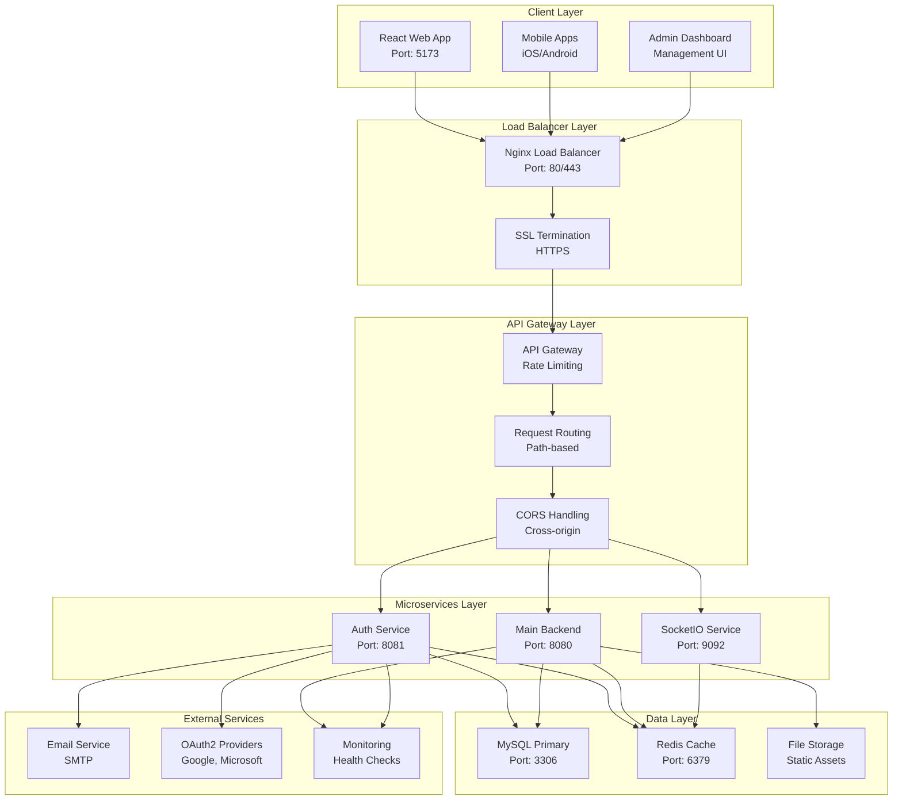

### 🔄 Request Processing Flow
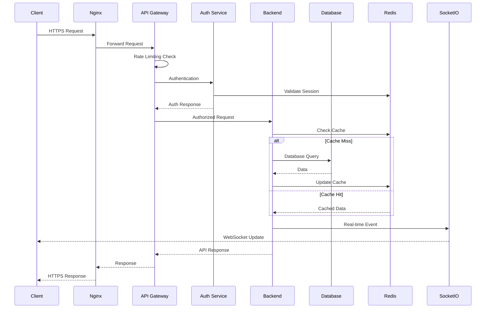

## 📦 Service Architecture

### 🔐 Authentication Service (`auth/`)
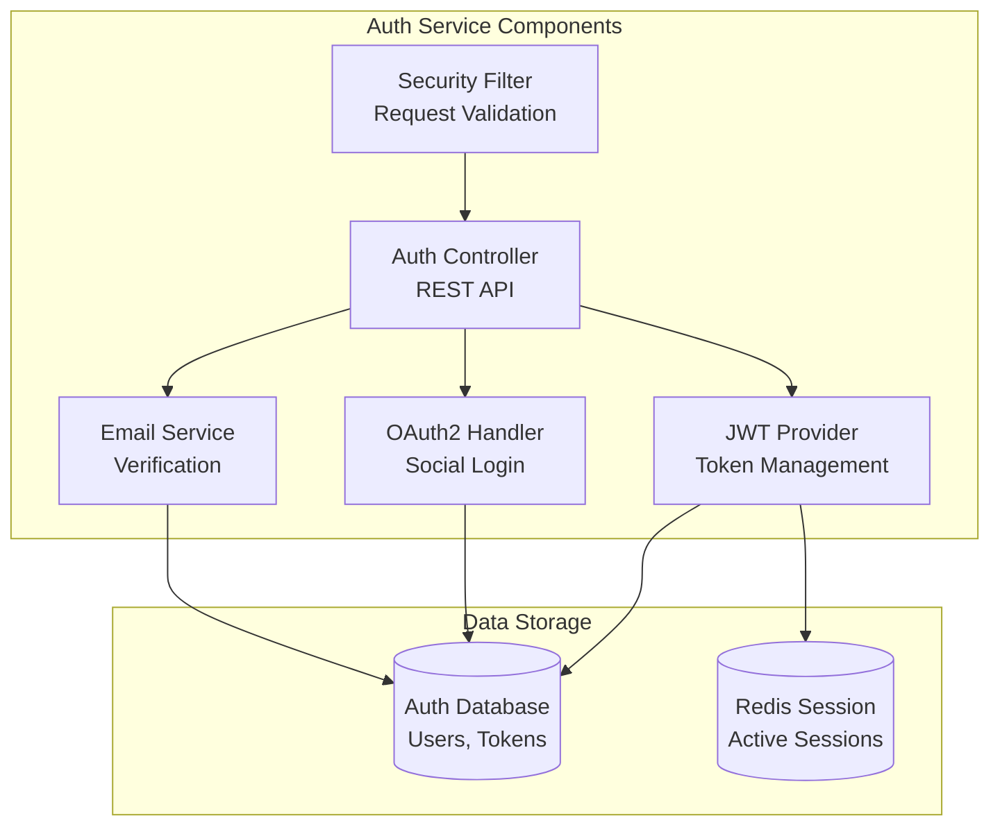

**Responsibilities:**
- 🔐 User authentication and authorization
- 🎫 JWT token generation and validation
- 📧 Email verification and password reset
- 🌐 OAuth2 social login integration
- 🛡️ Session management and security

### 🚀 Main Backend Service (`smarte-vent-backend/`)
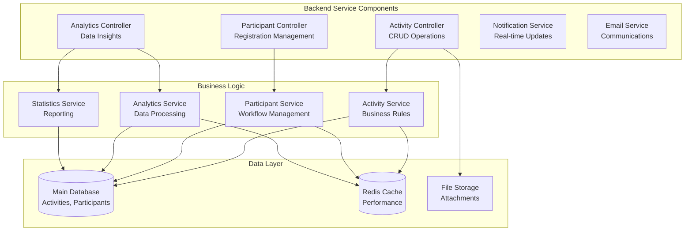

**Responsibilities:**
- 🎯 Activity lifecycle management
- 👥 Participant registration and approval
- 📊 Analytics and reporting
- 🔔 Real-time notifications
- 📧 Email communications

### 🌐 Frontend Application (`matcha-web-client/`)
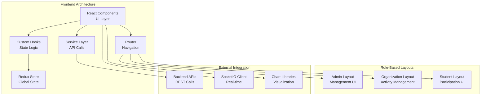

**Responsibilities:**
- 🎨 User interface and experience
- 🎭 Role-based navigation and features
- 📊 Data visualization and analytics
- ⚡ Real-time updates and notifications
- 📱 Responsive design

## 🔄 Data Flow

### 📊 Activity Creation Flow
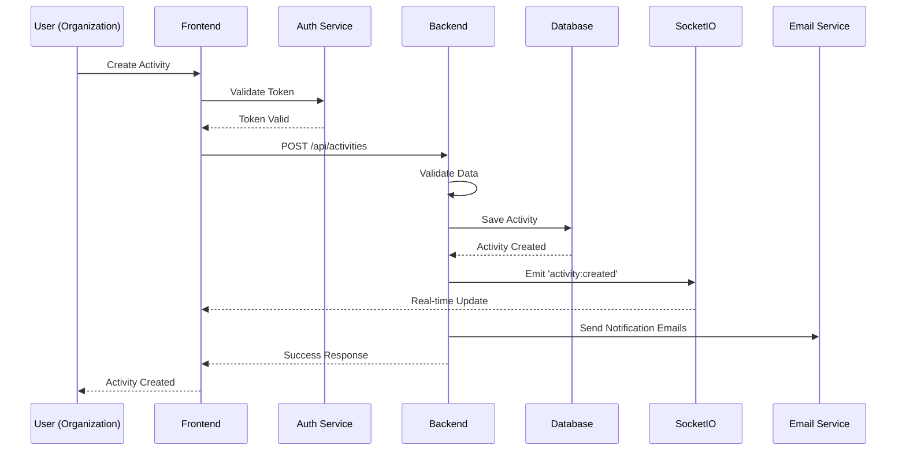

### 👥 Participant Registration Flow
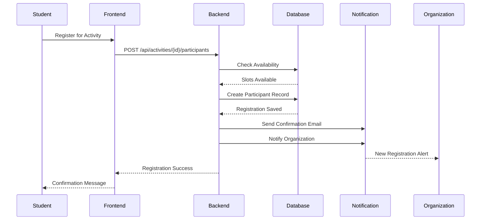

### 📈 Analytics Data Flow
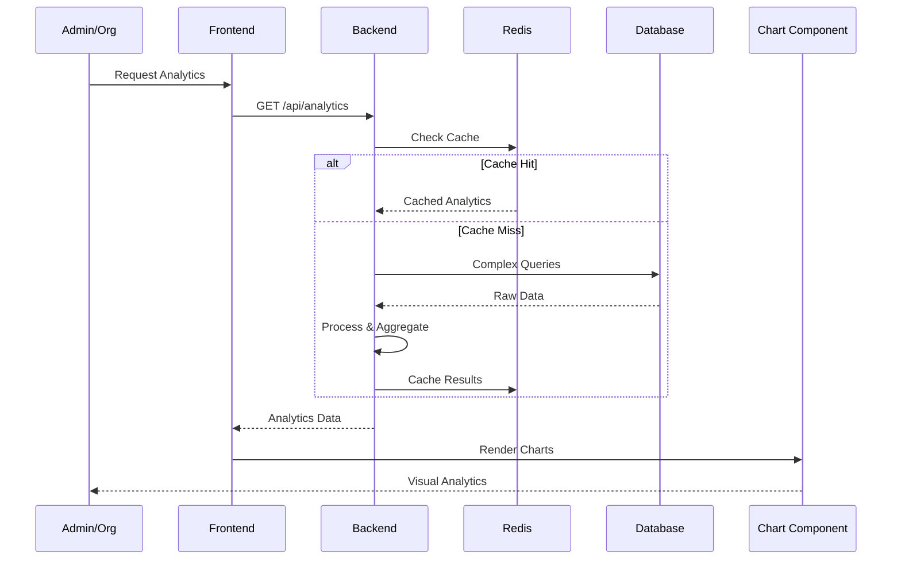

## 🗄️ Database Architecture

### 📊 Entity Relationship Diagram
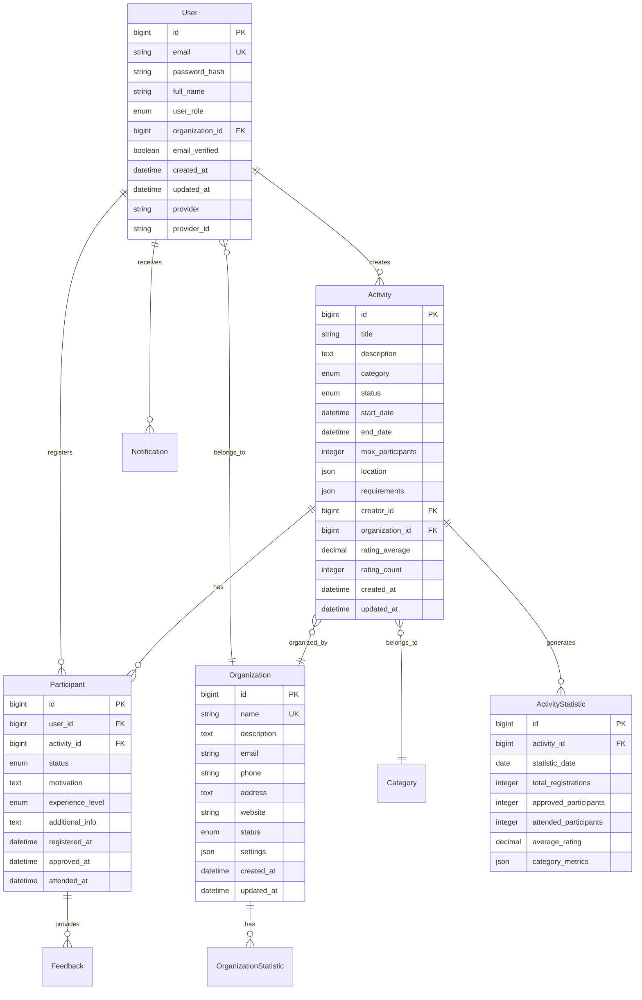

### 🏗️ Database Design Principles

#### 📊 Normalization Strategy
- **Third Normal Form (3NF)**: Eliminates data redundancy
- **Selective Denormalization**: For performance-critical queries
- **JSON Columns**: For flexible schema requirements
- **Indexes**: Optimized for query patterns

#### 🔄 Data Consistency
- **ACID Transactions**: Ensures data integrity
- **Foreign Key Constraints**: Maintains referential integrity
- **Unique Constraints**: Prevents duplicate data
- **Check Constraints**: Validates data quality

#### ⚡ Performance Optimization
```sql
-- Optimized indexes for common queries
CREATE INDEX idx_activity_organization_status ON activities(organization_id, status);
CREATE INDEX idx_participant_activity_status ON participants(activity_id, status);
CREATE INDEX idx_user_email_verified ON users(email, email_verified);
CREATE INDEX idx_activity_dates ON activities(start_date, end_date);

-- Composite indexes for analytics queries
CREATE INDEX idx_activity_stats_date_org ON activity_statistics(statistic_date, organization_id);
CREATE INDEX idx_participant_registered_approved ON participants(registered_at, approved_at);
```

## 🌐 API Architecture

### 🔌 RESTful API Design
```yaml
# API Structure Overview
/api/auth/              # Authentication endpoints
├── POST /login         # User authentication
├── POST /register      # User registration
├── POST /refresh       # Token refresh
└── POST /logout        # User logout

/api/activities/        # Activity management
├── GET /               # List activities (paginated, filtered)
├── POST /              # Create new activity
├── GET /{id}           # Get activity details
├── PUT /{id}           # Update activity
└── DELETE /{id}        # Delete activity

/api/participants/      # Participant management
├── GET /               # List participants
├── POST /register      # Register for activity
├── PUT /{id}/status    # Update participation status
└── GET /{id}/history   # Participation history

/api/analytics/         # Analytics and reporting
├── GET /activities     # Activity statistics
├── GET /organizations  # Organization metrics
├── GET /participants   # Participation data
└── GET /trends         # Trend analysis

/api/notifications/     # Notification system
├── GET /               # List notifications
├── PUT /{id}/read      # Mark as read
└── DELETE /{id}        # Delete notification
```

### 📊 API Response Standards
```json
{
  "success": true,
  "data": {
    "content": [...],
    "pagination": {
      "page": 0,
      "size": 20,
      "totalElements": 150,
      "totalPages": 8
    }
  },
  "message": "Request successful",
  "timestamp": "2024-01-15T10:30:00Z"
}
```

### 🚨 Error Response Format
```json
{
  "success": false,
  "error": {
    "code": "VALIDATION_ERROR",
    "message": "Invalid request data",
    "details": [
      {
        "field": "email",
        "message": "Email format is invalid"
      }
    ]
  },
  "timestamp": "2024-01-15T10:30:00Z",
  "path": "/api/auth/register"
}
```

## 🔐 Security Architecture

### 🛡️ Multi-Layer Security Model
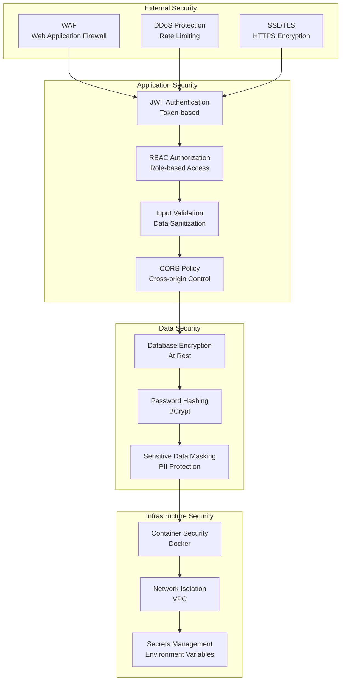

### 🔑 Authentication & Authorization Flow
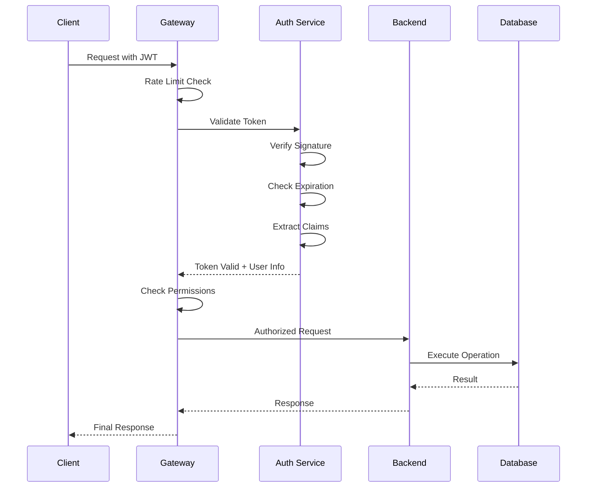

## 📡 Communication Patterns

### 🔄 Synchronous Communication (REST)
```typescript
// API Service Pattern
class ApiService {
  async makeRequest<T>(config: RequestConfig): Promise<T> {
    // Request interceptor
    const request = this.addAuthHeader(config);
    
    try {
      const response = await axios(request);
      return response.data;
    } catch (error) {
      // Error handling
      throw this.handleApiError(error);
    }
  }
}
```

### ⚡ Asynchronous Communication (WebSocket)
```typescript
// Real-time Event System
class SocketService {
  connect(token: string) {
    this.socket = io(SOCKET_URL, {
      auth: { token }
    });
    
    this.socket.on('activity:created', this.handleActivityCreated);
    this.socket.on('participant:approved', this.handleParticipantApproved);
    this.socket.on('notification:new', this.handleNewNotification);
  }
  
  private handleActivityCreated = (data: ActivityEvent) => {
    // Update UI in real-time
    eventBus.emit('UI_UPDATE', { type: 'ACTIVITY_CREATED', data });
  };
}
```

### 📧 Event-Driven Communication
```java
// Spring Event System
@EventListener
@Async
public void handleActivityCreated(ActivityCreatedEvent event) {
    // Send email notifications
    emailService.sendActivityNotification(event.getActivity());
    
    // Update statistics
    statisticsService.updateActivityStats(event.getOrganizationId());
    
    // Real-time notification
    socketIOService.broadcastActivityCreated(event);
}
```

## ⚡ Performance Architecture

### 🚀 Caching Strategy
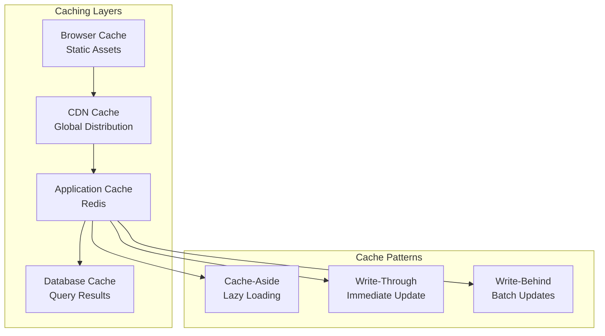

### 📊 Performance Metrics & Targets
| Metric | Target | Monitoring |
|--------|--------|------------|
| **API Response Time** | < 200ms | ✅ Prometheus |
| **Database Query Time** | < 50ms | ✅ Slow Query Log |
| **Cache Hit Rate** | > 80% | ✅ Redis Metrics |
| **Page Load Time** | < 2s | ✅ Lighthouse |
| **WebSocket Latency** | < 100ms | ✅ Custom Metrics |
| **Throughput** | 1000 RPS | ✅ Load Testing |

### 🔧 Performance Optimization Techniques
```java
// Database Query Optimization
@Query("""
    SELECT DISTINCT a FROM Activity a
    JOIN FETCH a.organization o
    LEFT JOIN FETCH a.participants p
    WHERE a.status = :status
    AND a.startDate BETWEEN :startDate AND :endDate
""")
List<Activity> findActivitiesOptimized(
    @Param("status") ActivityStatus status,
    @Param("startDate") LocalDateTime startDate,
    @Param("endDate") LocalDateTime endDate
);

// Caching Implementation
@Cacheable(value = "activities", key = "#organizationId + '_' + #status")
public List<ActivityDTO> getActivitiesByOrganization(
    Long organizationId, ActivityStatus status) {
    return activityRepository.findByOrganizationIdAndStatus(organizationId, status)
        .stream()
        .map(activityMapper::toDTO)
        .toList();
}
```

## 🚀 Deployment Architecture

### 🐳 Containerization Strategy
```yaml
# Docker Compose Production Setup
version: '3.8'
services:
  # Application Services
  auth-service:
    image: campushub/auth-service:latest
    replicas: 2
    resources:
      limits:
        memory: 512M
        cpus: '0.5'
    
  backend-service:
    image: campushub/backend-service:latest
    replicas: 3
    resources:
      limits:
        memory: 1G
        cpus: '1.0'
  
  frontend:
    image: campushub/frontend:latest
    replicas: 2
    
  # Infrastructure Services
  nginx:
    image: nginx:alpine
    ports:
      - "80:80"
      - "443:443"
    
  mysql:
    image: mysql:8.0
    volumes:
      - mysql-data:/var/lib/mysql
    
  redis:
    image: redis:7-alpine
    volumes:
      - redis-data:/data
```

### ☁️ Cloud Deployment Options
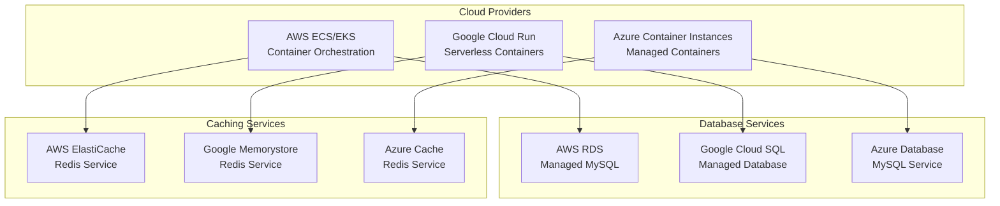

## 📊 Monitoring & Observability

### 📈 Observability Stack
```mermaid
graph TD
    subgraph "Metrics Collection"
        A[Prometheus<br/>Metrics Server]
        B[Grafana<br/>Visualization]
        C[Custom Metrics<br/>Business KPIs]
    end
    
    subgraph "Logging System"
        D[Structured Logging<br/>JSON Format]
        E[Log Aggregation<br/>ELK Stack]
        F[Log Analysis<br/>Search & Alerts]
    end
    
    subgraph "Distributed Tracing"
        G[Request Tracing<br/>Jaeger/Zipkin]
        H[Performance Analysis<br/>APM Tools]
        I[Error Tracking<br/>Sentry]
    end
    
    subgraph "Health Monitoring"
        J[Health Checks<br/>Spring Actuator]
        K[Uptime Monitoring<br/>External Services]
        L[Alert Management<br/>PagerDuty]
    end
    
    A --> B
    B --> C
    D --> E
    E --> F
    G --> H
    H --> I
    J --> K
    K --> L
```

### 🚨 Alert Configuration
```yaml
# Prometheus Alert Rules
groups:
  - name: campushub-alerts
    rules:
      - alert: HighResponseTime
        expr: http_request_duration_seconds{quantile="0.95"} > 0.5
        for: 5m
        labels:
          severity: warning
        annotations:
          summary: "High response time detected"
      
      - alert: DatabaseConnectionFailure
        expr: up{job="mysql"} == 0
        for: 1m
        labels:
          severity: critical
        annotations:
          summary: "Database connection failed"
      
      - alert: HighErrorRate
        expr: rate(http_requests_total{status=~"5.."}[5m]) > 0.1
        for: 5m
        labels:
          severity: critical
        annotations:
          summary: "High error rate detected"
```

## 🔄 Scalability Strategy

### 📈 Horizontal Scaling Plan
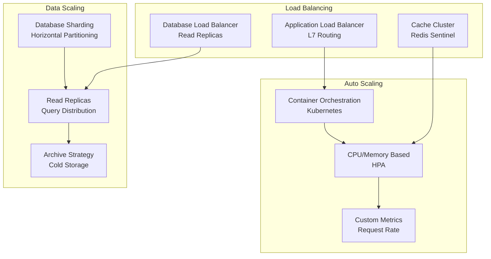

### 📊 Scaling Metrics & Triggers
| Resource | Metric | Scale Up Trigger | Scale Down Trigger |
|----------|--------|------------------|-------------------|
| **Web Servers** | CPU Usage | > 70% | < 30% |
| **API Servers** | Request Rate | > 1000 RPS | < 300 RPS |
| **Database** | Connection Pool | > 80% | < 40% |
| **Cache** | Memory Usage | > 85% | < 50% |
| **Storage** | Disk Usage | > 80% | N/A |

## 💡 Design Decisions

### 🎯 Technology Choices

#### Frontend: React + TypeScript
**Decision**: React with TypeScript for the frontend
**Rationale**: 
- ✅ Strong ecosystem and community support
- ✅ Excellent TypeScript integration
- ✅ Component reusability and maintainability
- ✅ Rich library ecosystem for charts and UI components

#### Backend: Spring Boot + Java 21
**Decision**: Spring Boot with Java 21
**Rationale**:
- ✅ Enterprise-grade framework with proven reliability
- ✅ Excellent ecosystem for microservices
- ✅ Strong security features out of the box
- ✅ Easy integration with databases and external services

#### Database: MySQL + Redis
**Decision**: MySQL for primary storage, Redis for caching
**Rationale**:
- ✅ MySQL: ACID compliance, mature ecosystem, good performance
- ✅ Redis: High-performance caching, session storage, pub/sub

#### Communication: REST + WebSocket
**Decision**: REST APIs for request/response, WebSocket for real-time
**Rationale**:
- ✅ REST: Standard, cacheable, stateless
- ✅ WebSocket: Real-time updates, bi-directional communication

### 🏗️ Architectural Patterns

#### Microservices Architecture
**Decision**: Separate authentication service from main backend
**Rationale**:
- ✅ Independent scaling and deployment
- ✅ Technology diversity (can use different tech stacks)
- ✅ Fault isolation (auth failure doesn't break entire system)
- ✅ Team autonomy (separate teams can work independently)

#### Event-Driven Communication
**Decision**: Asynchronous events for non-critical operations
**Rationale**:
- ✅ Better performance (non-blocking operations)
- ✅ Improved resilience (temporary service unavailability)
- ✅ Scalability (handles traffic spikes better)

#### Caching Strategy
**Decision**: Multi-layer caching with Redis
**Rationale**:
- ✅ Reduces database load
- ✅ Improves response times
- ✅ Better user experience
- ✅ Cost optimization (fewer database resources needed)

### 🔐 Security Decisions

#### JWT Tokens
**Decision**: JWT for stateless authentication
**Rationale**:
- ✅ Stateless (no server-side session storage needed)
- ✅ Scalable (works well with load balancers)
- ✅ Standard (widely supported)
- ✅ Secure (when implemented correctly)

#### Role-Based Access Control
**Decision**: RBAC with fine-grained permissions
**Rationale**:
- ✅ Flexible permission model
- ✅ Easy to understand and implement
- ✅ Scalable (new roles can be added easily)
- ✅ Audit-friendly (clear permission trails)

---

<div align="center">

**🏗️ CampusHub System Architecture - Designed for Scale & Performance**

[🏠 Main Project](./README.md) | [🔐 Auth Service](./auth/README.md) | [🚀 Backend](./smarte-vent-backend/README.md) | [🌐 Frontend](./matcha-web-client/README.md)

[📧 Architecture Questions](mailto:architecture@campushub.dev) | [🐛 Issues](https://github.com/activity-group3/fe-full/issues) | [💡 Improvements](https://github.com/activity-group3/fe-full/discussions)

</div>
