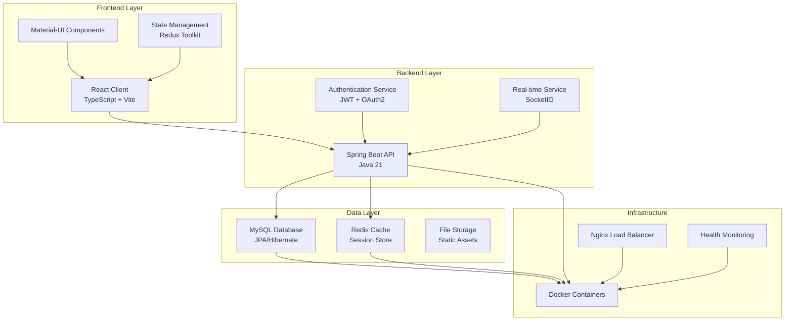
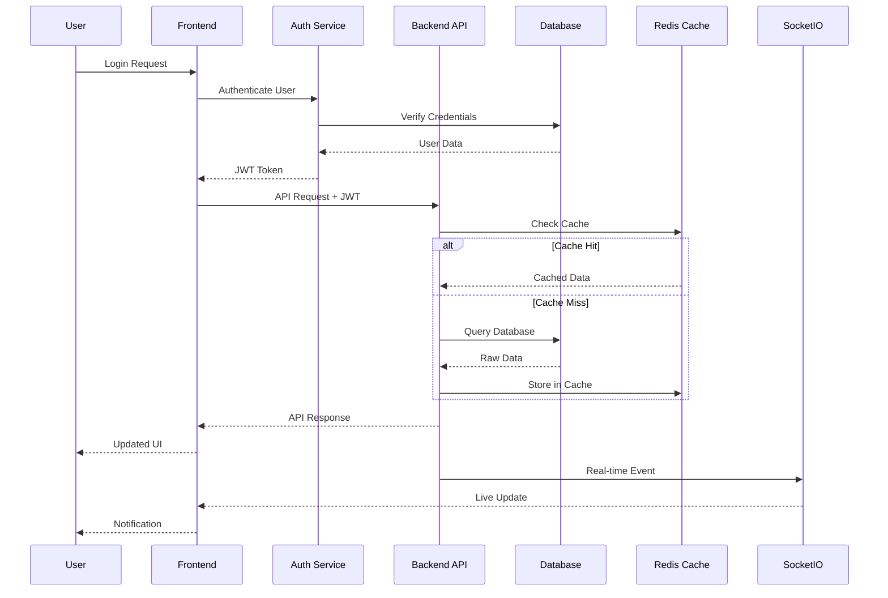

# 🎯 CampusHub - Activity Management Ecosystem

<div align="center">


[](LICENSE)
[](https://spring.io/projects/spring-boot)
[](https://reactjs.org/)
[](https://www.typescriptlang.org/)
[](https://www.mysql.com/)

</div>

## 📋 Table of Contents

- [🌟 Overview](#-overview)
- [🏗️ Architecture](#️-architecture)
- [📦 Project Structure](#-project-structure)
- [🚀 Quick Start](#-quick-start)
- [🔧 Technology Stack](#-technology-stack)
- [📊 System Flow](#-system-flow)
- [🌐 API Endpoints](#-api-endpoints)
- [🔐 Authentication](#-authentication)
- [📱 Features](#-features)
- [🎨 UI Components](#-ui-components)
- [📈 Analytics](#-analytics)
- [🔄 Real-time Communication](#-real-time-communication)
- [🐳 Docker Deployment](#-docker-deployment)
- [📚 Documentation](#-documentation)
- [🤝 Contributing](#-contributing)

## 🌟 Overview

**CampusHub** is a comprehensive activity management ecosystem designed for educational institutions. It provides a complete solution for managing student activities, organizational events, and administrative oversight through a modern, scalable architecture.

### 🎯 Core Mission
Transform how educational institutions manage activities by providing:
- **Streamlined Activity Lifecycle Management**
- **Real-time Communication & Notifications**
- **Advanced Analytics & Reporting**
- **Multi-Role User Management**
- **Automated Workflow Processing**

### 🏆 Key Benefits
- **📊 Data-Driven Insights**: Comprehensive analytics for decision making
- **⚡ Real-time Updates**: Instant notifications and live data synchronization
- **🎨 Modern UI/UX**: Responsive design with accessibility features
- **🔒 Enterprise Security**: JWT authentication with role-based access control
- **🚀 Scalable Architecture**: Microservices-ready with Docker containerization

## 🏗️ Architecture



## 📦 Project Structure

```
activity-group3/
├── 📁 auth/                          # 🔐 Authentication Service
│   └── src/main/resources/
│       └── application.yaml          # Auth service configuration
├── 📁 matcha-web-client/             # 🌐 React Frontend Application
│   ├── 📁 public/                    # Static assets and sounds
│   ├── 📁 src/                       # Source code
│   │   ├── 📁 components/            # Reusable UI components
│   │   ├── 📁 hooks/                 # Custom React hooks
│   │   ├── 📁 layouts/               # Role-based layouts
│   │   ├── 📁 pages/                 # Route components
│   │   ├── 📁 services/              # API service layer
│   │   ├── 📁 types/                 # TypeScript definitions
│   │   └── 📁 utils/                 # Utility functions
│   ├── package.json                  # Dependencies and scripts
│   ├── vite.config.ts               # Build configuration
│   └── tailwind.config.js           # Styling configuration
├── 📁 smarte-vent-backend/           # 🚀 Spring Boot Backend
│   ├── 📁 docker/                    # Docker configurations
│   ├── 📁 postman/                   # API testing collections
│   ├── 📁 prisma/                    # Database schema and migrations
│   ├── 📁 src/main/                  # Java source code
│   ├── docker-compose.yml           # Multi-service orchestration
│   ├── pom.xml                      # Maven dependencies
│   └── README.md                    # Backend documentation
└── README.md                        # This file
```

## 🚀 Quick Start

### Prerequisites
- **Java 21+** ☕
- **Node.js 18+** 🟢
- **Docker & Docker Compose** 🐳
- **MySQL 8.0+** 🗄️
- **Redis 7+** 🔴

### 1️⃣ Clone Repository
```bash
git clone https://github.com/activity-group3/fe-full.git
cd activity-group3
```

### 2️⃣ Backend Setup
```bash
cd smarte-vent-backend
# Copy environment template
cp docker/env-template .env
# Configure your environment variables
# Start all services
docker-compose up -d
```

### 3️⃣ Frontend Setup
```bash
cd matcha-web-client
npm install
npm run dev
```

### 4️⃣ Access Applications
- **Frontend**: http://localhost:5173 🌐
- **Backend API**: http://localhost:8080 🔧
- **Swagger Docs**: http://localhost:8080/swagger-ui.html 📚
- **phpMyAdmin**: http://localhost:8082 🗄️
- **Redis Commander**: http://localhost:8081 🔴

## 🔧 Technology Stack

### 🌐 Frontend Technologies
| Technology | Version | Purpose | Documentation |
|------------|---------|---------|---------------|
|  | 18.2.0 | UI Framework | [Docs](https://reactjs.org/) |
|  | 5.2.2 | Type Safety | [Docs](https://www.typescriptlang.org/) |
|  | 5.0.11 | Build Tool | [Docs](https://vitejs.dev/) |
|  | 5.17.1 | Component Library | [Docs](https://mui.com/) |
|  | 2.8.2 | State Management | [Docs](https://redux-toolkit.js.org/) |
|  | 3.4.1 | CSS Framework | [Docs](https://tailwindcss.com/) |

### 🚀 Backend Technologies
| Technology | Version | Purpose | Documentation |
|------------|---------|---------|---------------|
|  | 3.3.6 | Framework | [Docs](https://spring.io/projects/spring-boot) |
|  | 21 | Programming Language | [Docs](https://openjdk.java.net/) |
|  | 8.0 | Database | [Docs](https://dev.mysql.com/doc/) |
|  | 7 | Cache & Sessions | [Docs](https://redis.io/documentation) |
|  | 1.7.23 | Real-time Communication | [Docs](https://socket.io/docs/) |
|  | Latest | Containerization | [Docs](https://docs.docker.com/) |

## 📊 System Flow



## 🌐 API Endpoints

### 🔐 Authentication
| Method | Endpoint | Description | Auth Required |
|--------|----------|-------------|---------------|
| `POST` | `/api/auth/login` | User authentication | ❌ |
| `POST` | `/api/auth/register` | User registration | ❌ |
| `POST` | `/api/auth/refresh` | Token refresh | ✅ |
| `POST` | `/api/auth/logout` | User logout | ✅ |

### 🎯 Activities
| Method | Endpoint | Description | Auth Required |
|--------|----------|-------------|---------------|
| `GET` | `/api/activities` | List all activities | ✅ |
| `POST` | `/api/activities` | Create new activity | ✅ |
| `GET` | `/api/activities/{id}` | Get activity details | ✅ |
| `PUT` | `/api/activities/{id}` | Update activity | ✅ |
| `DELETE` | `/api/activities/{id}` | Delete activity | ✅ |

### 👥 Participants
| Method | Endpoint | Description | Auth Required |
|--------|----------|-------------|---------------|
| `GET` | `/api/participants` | List participants | ✅ |
| `POST` | `/api/participants/register` | Register for activity | ✅ |
| `PUT` | `/api/participants/{id}/status` | Update participation status | ✅ |

### 📊 Analytics
| Method | Endpoint | Description | Auth Required |
|--------|----------|-------------|---------------|
| `GET` | `/api/analytics/activities` | Activity statistics | ✅ |
| `GET` | `/api/analytics/organizations` | Organization metrics | ✅ |
| `GET` | `/api/analytics/participants` | Participation data | ✅ |

## 🔐 Authentication

### JWT Token Structure
```json
{
  "sub": "user_email@example.com",
  "roles": ["STUDENT", "ORGANIZATION", "ADMIN"],
  "iat": 1638360000,
  "exp": 1638446400,
  "userId": 12345,
  "organizationId": 67890
}
```

### Role-Based Access Control
| Role | Permissions | Dashboard Access |
|------|-------------|------------------|
| **👨‍🎓 STUDENT** | View activities, Register, Submit feedback | Student Dashboard |
| **🏢 ORGANIZATION** | Create activities, Manage participants, View analytics | Organization Dashboard |
| **👨‍💼 ADMIN** | Full system access, User management, System analytics | Admin Dashboard |

## 📱 Features

### 👨‍🎓 Student Features
- 🔍 **Activity Discovery**: Browse and search available activities
- ✍️ **Registration Management**: Easy registration and status tracking
- 📊 **Personal Dashboard**: Track participation history and achievements
- 💬 **Feedback System**: Rate and review completed activities
- 🔔 **Real-time Notifications**: Instant updates on activity changes

### 🏢 Organization Features
- 📝 **Activity Creation**: Rich editor for activity descriptions
- 👥 **Participant Management**: Advanced filtering and communication tools
- 📈 **Analytics Dashboard**: Detailed insights and performance metrics
- 📅 **Schedule Management**: Calendar integration and automated reminders
- 💼 **Profile Management**: Organization branding and information

### 👨‍💼 Admin Features
- 🛠️ **System Management**: Complete administrative control
- 👤 **User Management**: Account creation, role assignment, and verification
- 📊 **System Analytics**: Platform-wide statistics and trends
- 🔧 **Configuration**: System settings and feature toggles
- 🚨 **Monitoring**: Real-time system health and performance metrics

## 🎨 UI Components

### 📚 Component Library Structure
```
src/components/
├── 🔧 ui/                          # Base UI components
│   ├── Button.tsx                  # Customizable button component
│   ├── Input.tsx                   # Form input components
│   ├── Modal.tsx                   # Modal dialog system
│   └── Table.tsx                   # Data table component
├── 📊 charts/                      # Data visualization
│   ├── ActivityChart.tsx           # Activity analytics charts
│   ├── ParticipationChart.tsx      # Participation metrics
│   └── TrendChart.tsx              # Trend analysis
├── 🗂️ navigation/                  # Navigation components
│   ├── Navbar.tsx                  # Main navigation bar
│   ├── Sidebar.tsx                 # Role-based sidebar
│   └── Breadcrumb.tsx              # Navigation breadcrumbs
├── 📝 forms/                       # Form components
│   ├── ActivityForm.tsx            # Activity creation/editing
│   ├── RegistrationForm.tsx        # User registration
│   └── FeedbackForm.tsx            # Activity feedback
└── 🔔 notifications/               # Notification system
    ├── NotificationDropdown.tsx    # Notification display
    └── ToastProvider.tsx           # Toast notifications
```

### 🎨 Design System
- **Color Palette**: Material Design 3.0 compliant
- **Typography**: Inter font family with semantic sizing
- **Spacing**: 8px grid system
- **Responsive**: Mobile-first approach with breakpoints
- **Accessibility**: WCAG 2.1 AA compliance

## 📈 Analytics

### 📊 Available Metrics
- **Activity Metrics**: Creation trends, completion rates, category distribution
- **Participation Metrics**: Registration patterns, attendance rates, user engagement
- **Organization Metrics**: Performance comparison, growth tracking, success rates
- **System Metrics**: User activity, feature usage, performance indicators

### 📈 Chart Types
- **📊 Bar Charts**: Comparative data visualization
- **📈 Line Charts**: Trend analysis over time
- **🥧 Pie Charts**: Distribution and proportion analysis
- **📉 Area Charts**: Cumulative data representation
- **🎯 KPI Cards**: Key performance indicators

## 🔄 Real-time Communication

### 🔌 SocketIO Events
```typescript
// Client-side event listeners
socket.on('activity:created', (data) => {
  // Handle new activity notification
});

socket.on('participation:approved', (data) => {
  // Handle participation approval
});

socket.on('system:announcement', (data) => {
  // Handle system-wide announcements
});
```

### 📡 Real-time Features
- **🔔 Instant Notifications**: Activity updates, approvals, announcements
- **💬 Live Chat**: Real-time communication between participants
- **📊 Live Data**: Real-time dashboard updates
- **🔄 Sync Status**: Cross-device synchronization

## 🐳 Docker Deployment

### 🏗️ Service Architecture
```yaml
services:
  app:           # Spring Boot application
  mysql:         # Primary database
  redis:         # Cache and session store
  nginx:         # Load balancer (production)
  phpmyadmin:    # Database management (development)
  redis-commander: # Redis management (development)
```

### 🚀 Deployment Commands
```bash
# Development environment
docker-compose up -d

# Production environment
docker-compose --profile prod up -d

# Debug environment with management UIs
docker-compose --profile dev up -d
```

### 🔧 Environment Configuration
```bash
# Required environment variables
MAIL_USERNAME=your-email@gmail.com
MAIL_PASSWORD=your-app-password
JWT_SECRET=your-secure-jwt-secret
MYSQL_ROOT_PASSWORD=secure-password
```

## 📚 Documentation

### 📖 Available Documentation
- **[Backend API Documentation](./smarte-vent-backend/README.md)** - Comprehensive backend guide
- **[Frontend Documentation](./matcha-web-client/README.md)** - React application details
- **[Swagger API Docs](http://localhost:8080/swagger-ui.html)** - Interactive API documentation
- **[Database Schema](./smarte-vent-backend/swagger-documentation-readme.md)** - Database design and relationships
- **[Docker Guide](./smarte-vent-backend/DOCKER_USAGE.md)** - Containerization instructions

### 🛠️ Development Guides
- **[Folder Structure Recommendations](./matcha-web-client/FOLDER_STRUCTURE_RECOMMENDATION.md)**
- **[Hooks Refactoring Summary](./matcha-web-client/HOOKS_REFACTORING_SUMMARY.md)**
- **[Redis Integration Guide](./smarte-vent-backend/REDIS_SOCKETIO_INTEGRATION.md)**

## 🤝 Contributing

### 🔄 Development Workflow
1. **Fork** the repository
2. **Create** a feature branch (`git checkout -b feature/amazing-feature`)
3. **Commit** your changes (`git commit -m 'Add amazing feature'`)
4. **Push** to the branch (`git push origin feature/amazing-feature`)
5. **Open** a Pull Request

### 📋 Coding Standards
- **Frontend**: ESLint + Prettier configuration
- **Backend**: CheckStyle + SpotBugs analysis
- **Testing**: Minimum 80% code coverage
- **Documentation**: JSDoc for functions, README for modules

### 🧪 Testing Strategy
- **Unit Tests**: Jest (Frontend) + JUnit (Backend)
- **Integration Tests**: Cypress (E2E) + TestContainers (Backend)
- **API Tests**: Postman collections included

---

<div align="center">

**🎯 Built with ❤️ by the CampusHub Team**

[📧 Contact Us](mailto:team@campushub.dev) | [🐛 Report Bug](https://github.com/activity-group3/fe-full/issues) | [💡 Request Feature](https://github.com/activity-group3/fe-full/issues)

</div>
#
