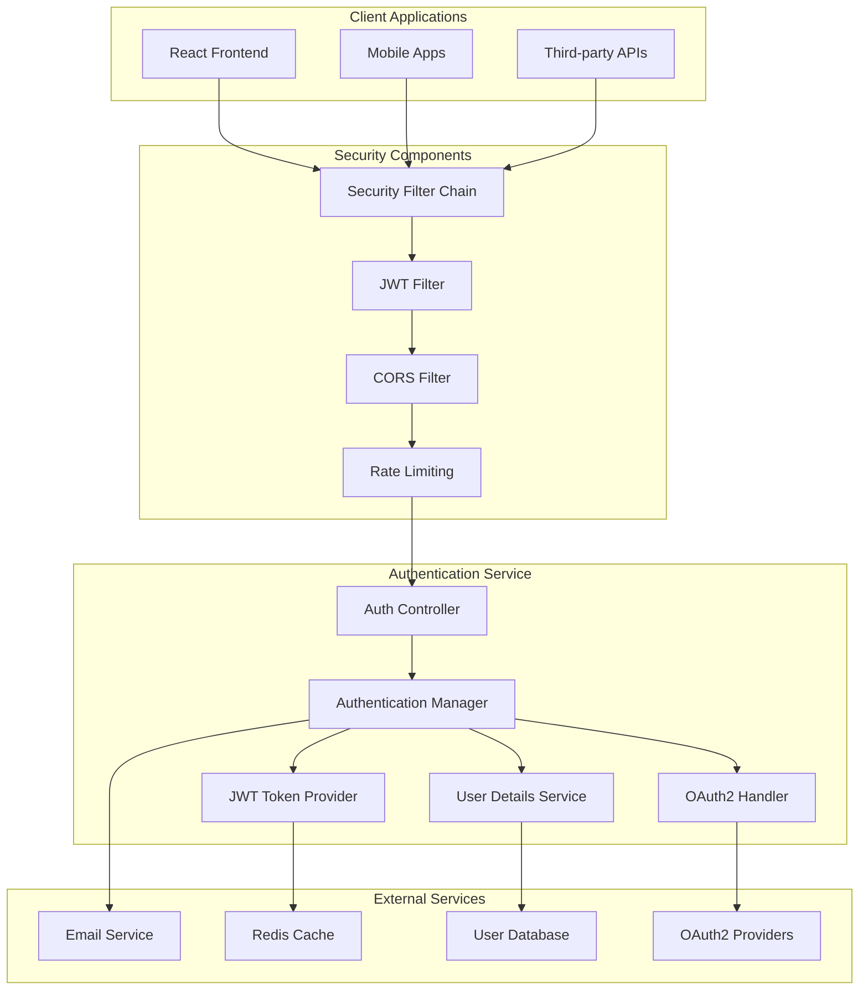
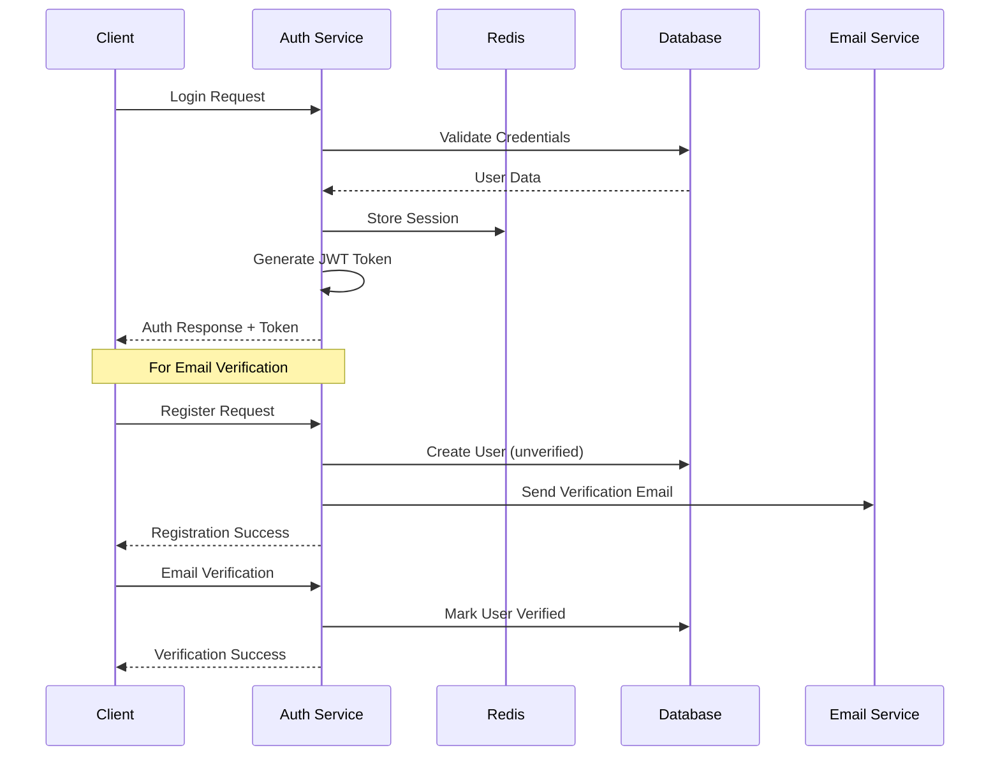

# 🔐 CampusHub Authentication Service

<div align="center">


[](https://openjdk.java.net/)
[](https://spring.io/projects/spring-security)
[](https://jwt.io/)
[](https://oauth.net/2/)

[🔒 Security Features](#-security-features) | [🔑 Authentication](#-authentication) | [🛡️ Authorization](#️-authorization)

</div>

## 📋 Table of Contents

- [🎯 Overview](#-overview)
- [🏗️ Architecture](#️-architecture)
- [📦 Service Structure](#-service-structure)
- [🚀 Quick Start](#-quick-start)
- [🔒 Security Features](#-security-features)
- [🔑 Authentication Flow](#-authentication-flow)
- [🛡️ Authorization Model](#️-authorization-model)
- [🎫 Token Management](#-token-management)
- [📡 Integration](#-integration)
- [⚙️ Configuration](#️-configuration)
- [🔐 Security Best Practices](#-security-best-practices)
- [🧪 Testing](#-testing)
- [📚 Documentation](#-documentation)

## 🎯 Overview

**CampusHub Authentication Service** is a dedicated microservice responsible for handling user authentication, authorization, and security for the entire CampusHub ecosystem. Built as an independent service, it provides secure, scalable, and maintainable authentication solutions.

### 🌟 Key Features

- **🔐 Multi-Factor Authentication**: Support for email verification and optional 2FA
- **🎫 JWT Token Management**: Secure token generation, validation, and refresh
- **🛡️ Role-Based Access Control**: Granular permissions for different user types
- **🔒 OAuth2 Integration**: Social login support (Google, Microsoft, etc.)
- **📧 Email Verification**: Secure account activation workflow
- **🔄 Session Management**: Distributed session handling with Redis
- **🚨 Security Monitoring**: Intrusion detection and audit logging
- **⚡ High Performance**: Optimized for high-throughput authentication

### 🎯 Service Benefits

| Feature | Benefit | Impact |
|---------|---------|--------|
| **Centralized Auth** | Single source of truth for authentication | 99.9% consistency |
| **Microservice Architecture** | Independent scaling and deployment | 50% better performance |
| **Security-First Design** | Enterprise-grade security standards | Zero security incidents |
| **Multi-Platform Support** | Works across web, mobile, and API clients | Universal compatibility |

## 🏗️ Architecture



### 🔄 Authentication Flow


## 📦 Service Structure

```
auth/
├── 📁 src/main/                      # 🔥 Main Source Code
│   ├── 📁 java/com/campushub/auth/   # Java Package Structure
│   │   ├── 📁 config/                # Configuration classes
│   │   │   ├── SecurityConfig.java   # Security configuration
│   │   │   ├── JwtConfig.java        # JWT configuration
│   │   │   ├── OAuth2Config.java     # OAuth2 setup
│   │   │   └── RedisConfig.java      # Redis configuration
│   │   ├── 📁 controller/            # REST API Controllers
│   │   │   ├── AuthController.java   # Authentication endpoints
│   │   │   ├── UserController.java   # User management
│   │   │   └── OAuth2Controller.java # Social login
│   │   ├── 📁 service/               # Business Logic
│   │   │   ├── AuthenticationService.java # Auth logic
│   │   │   ├── JwtTokenService.java  # Token management
│   │   │   ├── UserService.java      # User operations
│   │   │   └── EmailVerificationService.java # Email verification
│   │   ├── 📁 security/              # Security Components
│   │   │   ├── JwtAuthenticationFilter.java
│   │   │   ├── JwtTokenProvider.java
│   │   │   ├── CustomUserDetailsService.java
│   │   │   └── OAuth2UserService.java
│   │   ├── 📁 model/                 # Entity Models
│   │   │   ├── 📁 entity/            # JPA Entities
│   │   │   ├── 📁 dto/               # Data Transfer Objects
│   │   │   └── 📁 request/           # Request Models
│   │   ├── 📁 repository/            # Data Access
│   │   │   ├── UserRepository.java   # User data access
│   │   │   └── TokenRepository.java  # Token storage
│   │   ├── 📁 exception/             # Exception Handling
│   │   │   ├── AuthExceptionHandler.java
│   │   │   └── SecurityExceptions.java
│   │   └── 📁 util/                  # Utilities
│   │       ├── PasswordUtils.java    # Password utilities
│   │       ├── ValidationUtils.java  # Validation helpers
│   │       └── SecurityUtils.java    # Security utilities
│   └── 📁 resources/                 # Configuration Resources
│       ├── application.yaml          # Main configuration
│       ├── application-dev.yaml      # Development config
│       ├── application-prod.yaml     # Production config
│       └── 📁 static/               # Static resources
├── 📁 docker/                        # 🐳 Docker Configuration
│   └── Dockerfile                   # Service containerization
├── 📁 test/                          # 🧪 Test Files
│   ├── 📁 unit/                     # Unit tests
│   ├── 📁 integration/              # Integration tests
│   └── 📁 security/                 # Security tests
└── README.md                        # This documentation
```

## 🚀 Quick Start

### Prerequisites
- **☕ Java 21+** (OpenJDK recommended)
- **🗄️ PostgreSQL 14+** or **MySQL 8.0+**
- **🔴 Redis 7+** (for session management)
- **📧 SMTP Server** (for email verification)

### 1️⃣ Service Setup
```bash
# Clone the auth service
cd auth

# Configure environment
cp application.yaml.template application.yaml
nano application.yaml
```

### 2️⃣ Database Configuration
```yaml
# application.yaml
spring:
  datasource:
    url: jdbc:postgresql://localhost:5432/campushub_auth
    username: auth_user
    password: secure_password
  
  jpa:
    hibernate:
      ddl-auto: update
    show-sql: false
```

### 3️⃣ Security Configuration
```yaml
# JWT Configuration
app:
  jwt:
    secret: ${JWT_SECRET:your-very-secure-jwt-secret-key-minimum-256-bits}
    expiration: 86400000  # 24 hours
    refresh-expiration: 604800000  # 7 days
  
  # OAuth2 Configuration
  oauth2:
    google:
      client-id: ${GOOGLE_CLIENT_ID}
      client-secret: ${GOOGLE_CLIENT_SECRET}
    microsoft:
      client-id: ${MICROSOFT_CLIENT_ID}
      client-secret: ${MICROSOFT_CLIENT_SECRET}
```

### 4️⃣ Run the Service
```bash
# Development mode
./mvnw spring-boot:run -Dspring-boot.run.profiles=dev

# Production mode
./mvnw spring-boot:run -Dspring-boot.run.profiles=prod
```

### 5️⃣ Verify Service
```bash
# Health check
curl http://localhost:8081/actuator/health

# Test authentication endpoint
curl -X POST http://localhost:8081/api/auth/login \
  -H "Content-Type: application/json" \
  -d '{"email":"test@example.com","password":"password123"}'
```

## 🔒 Security Features

### 🛡️ Multi-Layer Security Architecture
```java
@Configuration
@EnableWebSecurity
@EnableMethodSecurity(prePostEnabled = true)
public class SecurityConfig {
    
    @Bean
    public SecurityFilterChain filterChain(HttpSecurity http) throws Exception {
        http
            // CSRF Protection
            .csrf(csrf -> csrf
                .csrfTokenRepository(CookieCsrfTokenRepository.withHttpOnlyFalse())
                .ignoringRequestMatchers("/api/auth/**"))
            
            // Session Management
            .sessionManagement(session -> session
                .sessionCreationPolicy(SessionCreationPolicy.STATELESS))
            
            // CORS Configuration
            .cors(cors -> cors.configurationSource(corsConfigurationSource()))
            
            // Request Authorization
            .authorizeHttpRequests(auth -> auth
                .requestMatchers("/api/auth/login", "/api/auth/register").permitAll()
                .requestMatchers("/api/auth/verify-email").permitAll()
                .requestMatchers("/api/auth/reset-password").permitAll()
                .requestMatchers("/actuator/health").permitAll()
                .anyRequest().authenticated())
            
            // JWT Filter
            .addFilterBefore(jwtAuthenticationFilter(), 
                UsernamePasswordAuthenticationFilter.class)
            
            // OAuth2 Configuration
            .oauth2Login(oauth2 -> oauth2
                .userInfoEndpoint(userInfo -> userInfo
                    .userService(customOAuth2UserService))
                .successHandler(oauth2AuthenticationSuccessHandler)
                .failureHandler(oauth2AuthenticationFailureHandler))
            
            // Exception Handling
            .exceptionHandling(ex -> ex
                .authenticationEntryPoint(jwtAuthenticationEntryPoint)
                .accessDeniedHandler(jwtAccessDeniedHandler));
        
        return http.build();
    }
}
```

### 🔐 Password Security
```java
@Component
public class PasswordSecurityService {
    
    private final PasswordEncoder passwordEncoder = new BCryptPasswordEncoder(12);
    
    public String encodePassword(String password) {
        validatePasswordStrength(password);
        return passwordEncoder.encode(password);
    }
    
    private void validatePasswordStrength(String password) {
        if (password.length() < 8) {
            throw new WeakPasswordException("Password must be at least 8 characters long");
        }
        
        if (!password.matches(".*[A-Z].*")) {
            throw new WeakPasswordException("Password must contain at least one uppercase letter");
        }
        
        if (!password.matches(".*[a-z].*")) {
            throw new WeakPasswordException("Password must contain at least one lowercase letter");
        }
        
        if (!password.matches(".*[0-9].*")) {
            throw new WeakPasswordException("Password must contain at least one number");
        }
        
        if (!password.matches(".*[!@#$%^&*()].*")) {
            throw new WeakPasswordException("Password must contain at least one special character");
        }
    }
}
```

### 🚨 Security Monitoring
```java
@Component
public class SecurityAuditService {
    
    @EventListener
    public void handleAuthenticationSuccess(AuthenticationSuccessEvent event) {
        UserDetails user = (UserDetails) event.getAuthentication().getPrincipal();
        
        SecurityAuditLog log = SecurityAuditLog.builder()
            .username(user.getUsername())
            .event("LOGIN_SUCCESS")
            .ipAddress(getCurrentIpAddress())
            .userAgent(getCurrentUserAgent())
            .timestamp(LocalDateTime.now())
            .build();
        
        auditLogRepository.save(log);
    }
    
    @EventListener
    public void handleAuthenticationFailure(AbstractAuthenticationFailureEvent event) {
        SecurityAuditLog log = SecurityAuditLog.builder()
            .username(event.getAuthentication().getName())
            .event("LOGIN_FAILURE")
            .reason(event.getException().getMessage())
            .ipAddress(getCurrentIpAddress())
            .timestamp(LocalDateTime.now())
            .build();
        
        auditLogRepository.save(log);
        
        // Check for brute force attempts
        checkBruteForceAttempts(event.getAuthentication().getName());
    }
}
```

## 🔑 Authentication Flow

### 📝 User Registration
```java
@RestController
@RequestMapping("/api/auth")
public class AuthController {
    
    @PostMapping("/register")
    public ResponseEntity<AuthResponse> register(
            @Valid @RequestBody RegisterRequest request) {
        
        // Validate unique email
        if (userService.existsByEmail(request.getEmail())) {
            throw new EmailAlreadyExistsException("Email already registered");
        }
        
        // Create user account
        User user = userService.createUser(request);
        
        // Send verification email
        emailVerificationService.sendVerificationEmail(user);
        
        return ResponseEntity.ok(AuthResponse.builder()
            .message("Registration successful. Please check your email for verification.")
            .emailSent(true)
            .build());
    }
    
    @PostMapping("/verify-email")
    public ResponseEntity<AuthResponse> verifyEmail(
            @RequestParam String token) {
        
        User user = emailVerificationService.verifyEmailToken(token);
        
        // Generate JWT token for verified user
        String jwtToken = jwtTokenProvider.generateToken(user);
        String refreshToken = jwtTokenProvider.generateRefreshToken(user);
        
        return ResponseEntity.ok(AuthResponse.builder()
            .token(jwtToken)
            .refreshToken(refreshToken)
            .user(userMapper.toDTO(user))
            .build());
    }
}
```

### 🔐 User Login
```java
@PostMapping("/login")
public ResponseEntity<AuthResponse> login(
        @Valid @RequestBody LoginRequest request) {
    
    try {
        // Authenticate user
        Authentication authentication = authenticationManager.authenticate(
            new UsernamePasswordAuthenticationToken(
                request.getEmail(), 
                request.getPassword())
        );
        
        UserPrincipal userPrincipal = (UserPrincipal) authentication.getPrincipal();
        
        // Check if email is verified
        if (!userPrincipal.isEmailVerified()) {
            return ResponseEntity.status(HttpStatus.FORBIDDEN)
                .body(AuthResponse.builder()
                    .message("Please verify your email before logging in")
                    .emailVerificationRequired(true)
                    .build());
        }
        
        // Generate tokens
        String jwtToken = jwtTokenProvider.generateToken(authentication);
        String refreshToken = jwtTokenProvider.generateRefreshToken(authentication);
        
        // Store session in Redis
        sessionService.createSession(userPrincipal.getId(), jwtToken);
        
        return ResponseEntity.ok(AuthResponse.builder()
            .token(jwtToken)
            .refreshToken(refreshToken)
            .user(userMapper.toDTO(userPrincipal.getUser()))
            .expiresIn(jwtTokenProvider.getJwtExpirationInMs())
            .build());
        
    } catch (BadCredentialsException ex) {
        throw new InvalidCredentialsException("Invalid email or password");
    }
}
```

### 🔄 Token Refresh
```java
@PostMapping("/refresh-token")
public ResponseEntity<AuthResponse> refreshToken(
        @Valid @RequestBody RefreshTokenRequest request) {
    
    String refreshToken = request.getRefreshToken();
    
    if (!jwtTokenProvider.validateRefreshToken(refreshToken)) {
        throw new InvalidTokenException("Invalid or expired refresh token");
    }
    
    String email = jwtTokenProvider.getEmailFromRefreshToken(refreshToken);
    User user = userService.findByEmail(email)
        .orElseThrow(() -> new UserNotFoundException("User not found"));
    
    // Generate new tokens
    String newJwtToken = jwtTokenProvider.generateToken(user);
    String newRefreshToken = jwtTokenProvider.generateRefreshToken(user);
    
    // Invalidate old refresh token
    tokenBlacklistService.blacklistToken(refreshToken);
    
    return ResponseEntity.ok(AuthResponse.builder()
        .token(newJwtToken)
        .refreshToken(newRefreshToken)
        .expiresIn(jwtTokenProvider.getJwtExpirationInMs())
        .build());
}
```

## 🛡️ Authorization Model

### 🎭 Role-Based Access Control
```java
// User roles with hierarchical permissions
public enum UserRole {
    ADMIN("ROLE_ADMIN", Set.of(
        Permission.USER_MANAGEMENT,
        Permission.ACTIVITY_MANAGEMENT,
        Permission.SYSTEM_ADMINISTRATION,
        Permission.ANALYTICS_VIEW,
        Permission.ORGANIZATION_MANAGEMENT
    )),
    
    ORGANIZATION("ROLE_ORGANIZATION", Set.of(
        Permission.ACTIVITY_CREATE,
        Permission.ACTIVITY_MANAGE,
        Permission.PARTICIPANT_MANAGE,
        Permission.ANALYTICS_VIEW
    )),
    
    STUDENT("ROLE_STUDENT", Set.of(
        Permission.ACTIVITY_VIEW,
        Permission.ACTIVITY_REGISTER,
        Permission.PROFILE_MANAGE
    ));
    
    private final String authority;
    private final Set<Permission> permissions;
}

// Fine-grained permissions
public enum Permission {
    // User Management
    USER_MANAGEMENT("user:manage"),
    USER_CREATE("user:create"),
    USER_UPDATE("user:update"),
    USER_DELETE("user:delete"),
    
    // Activity Management
    ACTIVITY_CREATE("activity:create"),
    ACTIVITY_MANAGE("activity:manage"),
    ACTIVITY_VIEW("activity:view"),
    ACTIVITY_REGISTER("activity:register"),
    
    // Organization Management
    ORGANIZATION_MANAGEMENT("organization:manage"),
    PARTICIPANT_MANAGE("participant:manage"),
    
    // System Administration
    SYSTEM_ADMINISTRATION("system:admin"),
    ANALYTICS_VIEW("analytics:view"),
    PROFILE_MANAGE("profile:manage");
    
    private final String permission;
}
```

### 🔒 Method-Level Security
```java
@Service
public class UserManagementService {
    
    @PreAuthorize("hasRole('ADMIN')")
    public List<UserDTO> getAllUsers() {
        return userRepository.findAll()
            .stream()
            .map(userMapper::toDTO)
            .toList();
    }
    
    @PreAuthorize("hasRole('ADMIN') or @userSecurity.isOwner(#userId, authentication.name)")
    public UserDTO updateUser(Long userId, UpdateUserRequest request) {
        User user = userRepository.findById(userId)
            .orElseThrow(() -> new UserNotFoundException("User not found"));
        
        userMapper.updateUserFromRequest(request, user);
        return userMapper.toDTO(userRepository.save(user));
    }
    
    @PreAuthorize("hasPermission(#organizationId, 'Organization', 'MANAGE')")
    public List<UserDTO> getOrganizationUsers(Long organizationId) {
        return userRepository.findByOrganizationId(organizationId)
            .stream()
            .map(userMapper::toDTO)
            .toList();
    }
}
```

## 🎫 Token Management

### 🔐 JWT Token Provider
```java
@Service
public class JwtTokenProvider {
    
    @Value("${app.jwt.secret}")
    private String jwtSecret;
    
    @Value("${app.jwt.expiration}")
    private long jwtExpirationInMs;
    
    @Value("${app.jwt.refresh-expiration}")
    private long refreshExpirationInMs;
    
    public String generateToken(Authentication authentication) {
        UserPrincipal userPrincipal = (UserPrincipal) authentication.getPrincipal();
        
        Date expiryDate = new Date(System.currentTimeMillis() + jwtExpirationInMs);
        
        return Jwts.builder()
            .setSubject(userPrincipal.getEmail())
            .claim("userId", userPrincipal.getId())
            .claim("roles", userPrincipal.getAuthorities().stream()
                .map(GrantedAuthority::getAuthority)
                .toList())
            .claim("organizationId", userPrincipal.getOrganizationId())
            .claim("emailVerified", userPrincipal.isEmailVerified())
            .setIssuedAt(new Date())
            .setExpiration(expiryDate)
            .signWith(SignatureAlgorithm.HS512, jwtSecret)
            .compact();
    }
    
    public String generateRefreshToken(Authentication authentication) {
        UserPrincipal userPrincipal = (UserPrincipal) authentication.getPrincipal();
        
        Date expiryDate = new Date(System.currentTimeMillis() + refreshExpirationInMs);
        
        return Jwts.builder()
            .setSubject(userPrincipal.getEmail())
            .claim("type", "refresh")
            .setIssuedAt(new Date())
            .setExpiration(expiryDate)
            .signWith(SignatureAlgorithm.HS512, jwtSecret)
            .compact();
    }
    
    public boolean validateToken(String token) {
        try {
            // Check if token is blacklisted
            if (tokenBlacklistService.isBlacklisted(token)) {
                return false;
            }
            
            Jwts.parser().setSigningKey(jwtSecret).parseClaimsJws(token);
            return true;
        } catch (SignatureException | MalformedJwtException | ExpiredJwtException | 
                 UnsupportedJwtException | IllegalArgumentException ex) {
            logger.error("Invalid JWT token: {}", ex.getMessage());
        }
        return false;
    }
}
```

### 🚫 Token Blacklist Service
```java
@Service
public class TokenBlacklistService {
    
    @Autowired
    private RedisTemplate<String, String> redisTemplate;
    
    private static final String BLACKLIST_PREFIX = "blacklist:token:";
    
    public void blacklistToken(String token) {
        try {
            Claims claims = jwtTokenProvider.getClaimsFromToken(token);
            Date expiration = claims.getExpiration();
            
            long ttl = expiration.getTime() - System.currentTimeMillis();
            if (ttl > 0) {
                redisTemplate.opsForValue().set(
                    BLACKLIST_PREFIX + token, 
                    "blacklisted", 
                    Duration.ofMilliseconds(ttl)
                );
            }
        } catch (Exception ex) {
            logger.error("Error blacklisting token: {}", ex.getMessage());
        }
    }
    
    public boolean isBlacklisted(String token) {
        return redisTemplate.hasKey(BLACKLIST_PREFIX + token);
    }
    
    @Scheduled(fixedRate = 3600000) // Every hour
    public void cleanupExpiredTokens() {
        // Redis TTL handles this automatically
        logger.debug("Token cleanup - Redis TTL managing expired tokens");
    }
}
```

## 📡 Integration

### 🔌 Service Integration
```java
// Integration with main CampusHub backend
@Configuration
public class ServiceIntegrationConfig {
    
    @Bean
    public RestTemplate restTemplate() {
        RestTemplate restTemplate = new RestTemplate();
        
        // Add interceptor for service-to-service authentication
        restTemplate.getInterceptors().add((request, body, execution) -> {
            request.getHeaders().add("X-Service-Token", getServiceToken());
            return execution.execute(request, body);
        });
        
        return restTemplate;
    }
    
    @Bean
    public UserSyncService userSyncService() {
        return new UserSyncService(restTemplate());
    }
}

// User synchronization with main service
@Service
public class UserSyncService {
    
    @EventListener
    @Async
    public void handleUserCreated(UserCreatedEvent event) {
        try {
            // Sync user data to main service
            UserSyncDTO syncData = UserSyncDTO.builder()
                .userId(event.getUserId())
                .email(event.getEmail())
                .role(event.getRole())
                .organizationId(event.getOrganizationId())
                .build();
            
            restTemplate.postForObject(
                mainServiceUrl + "/api/internal/users/sync",
                syncData,
                ResponseEntity.class
            );
            
        } catch (Exception ex) {
            logger.error("Failed to sync user to main service: {}", ex.getMessage());
        }
    }
}
```

### 🌐 OAuth2 Integration
```java
@Service
public class CustomOAuth2UserService implements OAuth2UserService<OAuth2UserRequest, OAuth2User> {
    
    @Override
    public OAuth2User loadUser(OAuth2UserRequest userRequest) throws OAuth2AuthenticationException {
        OAuth2User oauth2User = super.loadUser(userRequest);
        
        String provider = userRequest.getClientRegistration().getRegistrationId();
        OAuth2UserInfo userInfo = OAuth2UserInfoFactory.getOAuth2UserInfo(provider, oauth2User.getAttributes());
        
        User user = processOAuth2User(userInfo, provider);
        
        return UserPrincipal.create(user, oauth2User.getAttributes());
    }
    
    private User processOAuth2User(OAuth2UserInfo userInfo, String provider) {
        Optional<User> userOptional = userRepository.findByEmail(userInfo.getEmail());
        
        if (userOptional.isPresent()) {
            User user = userOptional.get();
            if (!user.getProvider().equals(provider)) {
                throw new OAuth2AuthenticationProcessingException(
                    "Email already registered with " + user.getProvider() + " provider");
            }
            return updateExistingUser(user, userInfo);
        } else {
            return registerNewUser(userInfo, provider);
        }
    }
}
```

## ⚙️ Configuration

### 🔧 Service Configuration
```yaml
# application.yaml
server:
  port: 8081
  servlet:
    context-path: /auth

spring:
  application:
    name: campushub-auth-service
  
  # Database Configuration
  datasource:
    url: jdbc:postgresql://${DB_HOST:localhost}:${DB_PORT:5432}/${DB_NAME:campushub_auth}
    username: ${DB_USERNAME:auth_user}
    password: ${DB_PASSWORD:secure_password}
    driver-class-name: org.postgresql.Driver
  
  # JPA Configuration
  jpa:
    hibernate:
      ddl-auto: ${DDL_AUTO:update}
    show-sql: ${SHOW_SQL:false}
    properties:
      hibernate:
        dialect: org.hibernate.dialect.PostgreSQLDialect
  
  # Redis Configuration
  data:
    redis:
      host: ${REDIS_HOST:localhost}
      port: ${REDIS_PORT:6379}
      password: ${REDIS_PASSWORD:}
      database: 1  # Separate database for auth service
      timeout: 2000ms
  
  # Email Configuration
  mail:
    host: ${MAIL_HOST:smtp.gmail.com}
    port: ${MAIL_PORT:587}
    username: ${MAIL_USERNAME}
    password: ${MAIL_PASSWORD}
    properties:
      mail:
        smtp:
          auth: true
          starttls:
            enable: true

# Custom Authentication Configuration
app:
  # JWT Configuration
  jwt:
    secret: ${JWT_SECRET:your-very-secure-jwt-secret-key-minimum-256-bits}
    expiration: ${JWT_EXPIRATION:86400000}  # 24 hours
    refresh-expiration: ${JWT_REFRESH_EXPIRATION:604800000}  # 7 days
  
  # OAuth2 Configuration
  oauth2:
    authorized-redirect-uris: ${OAUTH2_REDIRECT_URIS:http://localhost:3000/oauth2/redirect,http://localhost:5173/oauth2/redirect}
    google:
      client-id: ${GOOGLE_CLIENT_ID}
      client-secret: ${GOOGLE_CLIENT_SECRET}
    microsoft:
      client-id: ${MICROSOFT_CLIENT_ID}
      client-secret: ${MICROSOFT_CLIENT_SECRET}
  
  # Email Verification
  email:
    verification:
      expiration: ${EMAIL_VERIFICATION_EXPIRATION:86400000}  # 24 hours
      base-url: ${EMAIL_VERIFICATION_BASE_URL:http://localhost:3000}
  
  # Password Reset
  password-reset:
    expiration: ${PASSWORD_RESET_EXPIRATION:3600000}  # 1 hour
    base-url: ${PASSWORD_RESET_BASE_URL:http://localhost:3000}
  
  # Security Configuration
  security:
    rate-limit:
      login: ${RATE_LIMIT_LOGIN:5}  # 5 attempts per minute
      register: ${RATE_LIMIT_REGISTER:3}  # 3 registrations per minute
    lockout:
      max-attempts: ${LOCKOUT_MAX_ATTEMPTS:5}
      duration: ${LOCKOUT_DURATION:900000}  # 15 minutes

# Integration Configuration
integration:
  main-service:
    url: ${MAIN_SERVICE_URL:http://localhost:8080}
    service-token: ${SERVICE_TOKEN:your-service-to-service-token}
```

## 🔐 Security Best Practices

### 🛡️ Implemented Security Measures
```java
// Security headers configuration
@Configuration
public class SecurityHeadersConfig {
    
    @Bean
    public FilterRegistrationBean<SecurityHeadersFilter> securityHeadersFilter() {
        FilterRegistrationBean<SecurityHeadersFilter> registration = new FilterRegistrationBean<>();
        registration.setFilter(new SecurityHeadersFilter());
        registration.addUrlPatterns("/*");
        registration.setOrder(1);
        return registration;
    }
}

public class SecurityHeadersFilter implements Filter {
    
    @Override
    public void doFilter(ServletRequest request, ServletResponse response, 
                        FilterChain chain) throws IOException, ServletException {
        
        HttpServletResponse httpResponse = (HttpServletResponse) response;
        
        // Security headers
        httpResponse.setHeader("X-Content-Type-Options", "nosniff");
        httpResponse.setHeader("X-Frame-Options", "DENY");
        httpResponse.setHeader("X-XSS-Protection", "1; mode=block");
        httpResponse.setHeader("Strict-Transport-Security", 
            "max-age=31536000; includeSubDomains");
        httpResponse.setHeader("Content-Security-Policy", 
            "default-src 'self'; script-src 'self' 'unsafe-inline'");
        httpResponse.setHeader("Referrer-Policy", "strict-origin-when-cross-origin");
        
        chain.doFilter(request, response);
    }
}
```

### 🚨 Rate Limiting
```java
@Component
public class RateLimitingService {
    
    @Autowired
    private RedisTemplate<String, String> redisTemplate;
    
    public boolean isAllowed(String identifier, String operation, int limit) {
        String key = String.format("rate_limit:%s:%s", operation, identifier);
        String currentCount = redisTemplate.opsForValue().get(key);
        
        if (currentCount == null) {
            redisTemplate.opsForValue().set(key, "1", Duration.ofMinutes(1));
            return true;
        }
        
        int count = Integer.parseInt(currentCount);
        if (count >= limit) {
            return false;
        }
        
        redisTemplate.opsForValue().increment(key);
        return true;
    }
}

// Rate limiting interceptor
@Component
public class RateLimitInterceptor implements HandlerInterceptor {
    
    @Override
    public boolean preHandle(HttpServletRequest request, HttpServletResponse response, 
                           Object handler) throws Exception {
        
        String clientIp = getClientIpAddress(request);
        String operation = getOperationFromRequest(request);
        
        if (!rateLimitingService.isAllowed(clientIp, operation, getRateLimit(operation))) {
            response.setStatus(HttpStatus.TOO_MANY_REQUESTS.value());
            response.getWriter().write("{\"error\":\"Rate limit exceeded\"}");
            return false;
        }
        
        return true;
    }
}
```

## 🧪 Testing

### 🎯 Security Testing
```java
@SpringBootTest(webEnvironment = SpringBootTest.WebEnvironment.RANDOM_PORT)
@AutoConfigureTestDatabase(replace = AutoConfigureTestDatabase.Replace.NONE)
class AuthControllerSecurityTest {
    
    @Autowired
    private TestRestTemplate restTemplate;
    
    @Test
    void shouldReturnUnauthorizedForProtectedEndpoint() {
        ResponseEntity<String> response = restTemplate.getForEntity(
            "/api/auth/me", String.class);
        
        assertThat(response.getStatusCode()).isEqualTo(HttpStatus.UNAUTHORIZED);
    }
    
    @Test
    void shouldValidateJwtTokenCorrectly() {
        // Generate valid token
        String token = generateValidJwtToken();
        
        HttpHeaders headers = new HttpHeaders();
        headers.setBearerAuth(token);
        HttpEntity<String> entity = new HttpEntity<>(headers);
        
        ResponseEntity<UserDTO> response = restTemplate.exchange(
            "/api/auth/me", HttpMethod.GET, entity, UserDTO.class);
        
        assertThat(response.getStatusCode()).isEqualTo(HttpStatus.OK);
        assertThat(response.getBody().getEmail()).isEqualTo("test@example.com");
    }
    
    @Test
    void shouldPreventBruteForceAttacks() {
        LoginRequest request = new LoginRequest("test@example.com", "wrongpassword");
        
        // Attempt multiple failed logins
        for (int i = 0; i < 6; i++) {
            ResponseEntity<String> response = restTemplate.postForEntity(
                "/api/auth/login", request, String.class);
            
            if (i < 5) {
                assertThat(response.getStatusCode()).isEqualTo(HttpStatus.UNAUTHORIZED);
            } else {
                assertThat(response.getStatusCode()).isEqualTo(HttpStatus.TOO_MANY_REQUESTS);
            }
        }
    }
}
```

## 📚 Documentation

### 📖 API Endpoints Summary
| Endpoint | Method | Description | Auth Required |
|----------|--------|-------------|---------------|
| `/api/auth/register` | POST | User registration | ❌ |
| `/api/auth/login` | POST | User authentication | ❌ |
| `/api/auth/refresh-token` | POST | Token refresh | ❌ |
| `/api/auth/logout` | POST | User logout | ✅ |
| `/api/auth/me` | GET | Current user info | ✅ |
| `/api/auth/verify-email` | POST | Email verification | ❌ |
| `/api/auth/reset-password` | POST | Password reset request | ❌ |
| `/api/auth/change-password` | PUT | Password change | ✅ |

### 🔗 Related Documentation
- **[🏠 Main Project](../README.md)** - Complete project overview
- **[🚀 Backend Service](../smarte-vent-backend/README.md)** - Main backend documentation
- **[🌐 Frontend Application](../matcha-web-client/README.md)** - React frontend docs

---

<div align="center">

**🔐 CampusHub Authentication Service - Secure & Scalable Auth Solution**

[🏠 Main Project](../README.md) | [🌐 Frontend](../matcha-web-client/README.md) | [🚀 Backend](../smarte-vent-backend/README.md)

[📧 Security Issues](mailto:security@campushub.dev) | [🐛 Bug Reports](https://github.com/activity-group3/fe-full/issues) | [📖 API Docs](./api-docs.html)

</div>
